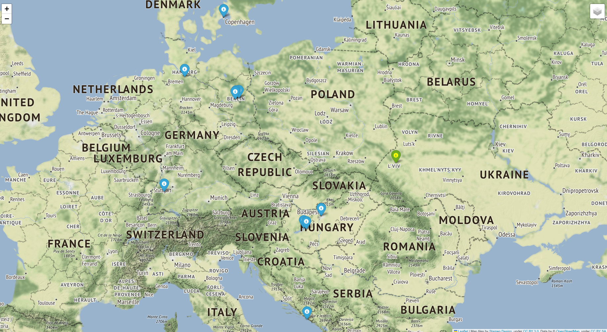

# Модуль `geofilm`

## Призначення

Модуль `geofilm` призначений для створення вебкарти (html сторінки). 

## Результат роботи модуля

На вебкарті відображається інформація про місця де знімалися фільми, які були зняті того чи іншого року. 

Карта має три шари (основний шар, шар розташування, яке вказав користувач та шар міток фільмів). На карті зображені не більше ніж 10 міток найближчих місць знімання фільмів.

## Використання модуля
 
Дані про місця мають передаватися з набору даних який знаходиться у файлі (наприклад `locations.list`).

Користувач вказує при виклику модуля з командного рядка для фільмів якого року (`year`) він бажає побудувати карту та свою локацію як широту (`latitude`) та довготу (`longitude`) (Наприклад `49.83826 24.02324`), і як результат отримує HTML файл.
 
Модуль `geofilm` підтримує виклик з командного рядка. 

Для цього необхідно виконати команду у наступному форматі

```bash
python main.py 2010 49.817545 24.023932 locations5000.list
```

